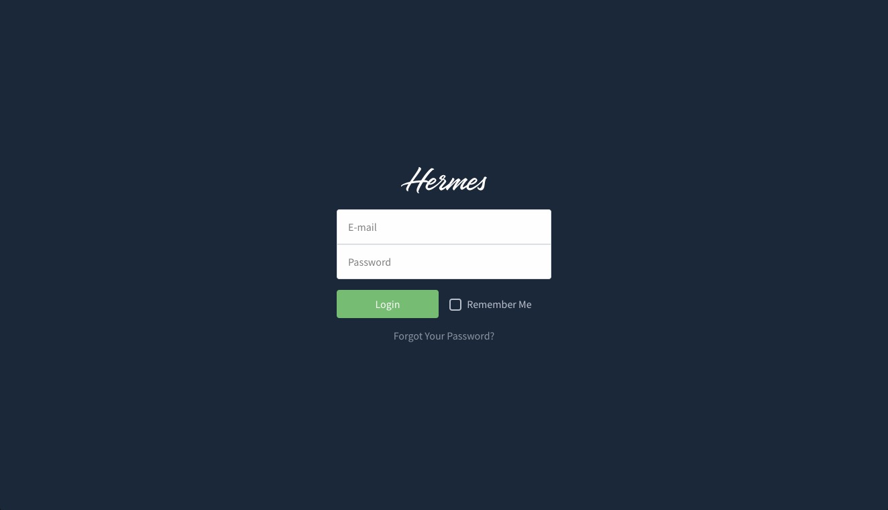
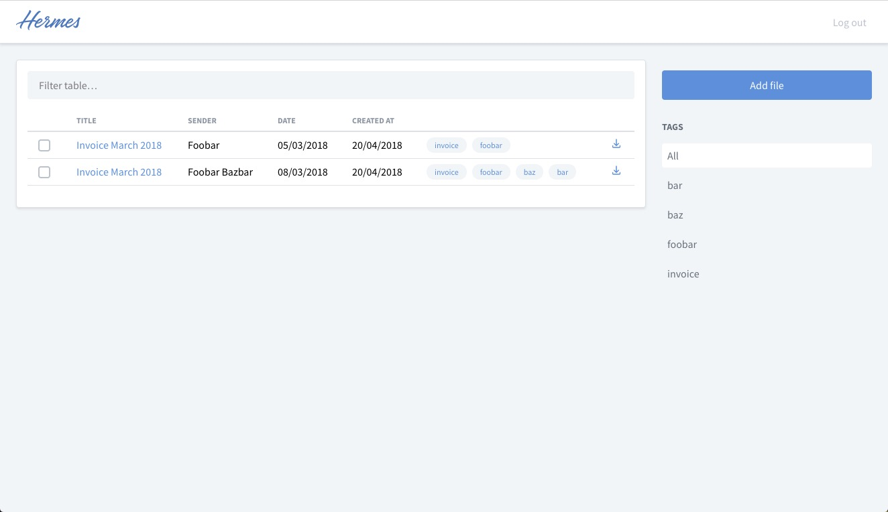
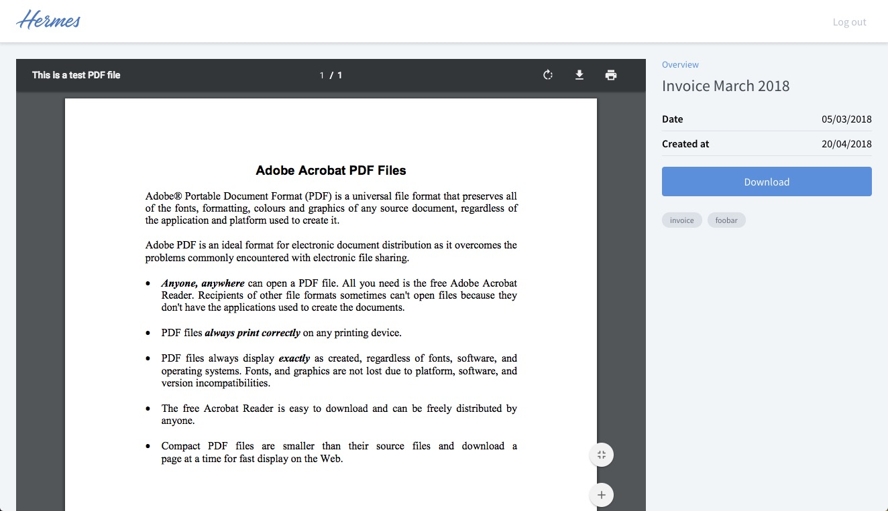

# Hermes

Index and archive all of your scanned paper documents.

I don't like paperwork. I hate searching for papers. This is an attempt to make my life easier.

## Todo

* [x] Basic setup
* [x] Mass export
* [x] Delete file
* [ ] Cleanup images with [Unpaper](https://www.flameeyes.eu/projects/unpaper)
* [x] Don't expose files directly
* [ ] Edit tags, title, date
* [x] Filter
* [x] Logo
* [x] Login styling
* [ ] ~~Backup files on Google Drive~~
* [ ] Pull files on Google Drive

## Installation

Hermes depends on the following:

* Git
* PHP 7.0+
* Composer
* MySQL
* ImageMagick 
* Ghostscript
* pdftotext
* Tesseract
* Unpaper

#### 1. Install dependencies

```bash
    sudo apt-get install imagemagick ghostscript poppler-utils tesseract-ocr unpaper
```

or for Mac OS

```bash
    brew install ghostscript
    brew cask install pdftotext
    brew install tesseract --with-all-languages
    brew install unpaper
```

#### 2. Clone the repository

```bash
    git clone https://github.com/nckg/hermes.git
```

#### 3. Setup the database
Log in with the root account to configure the database.

    mysql -uroot -p

Create a database called 'hermes'.

    CREATE DATABASE hermes;

Create a user called 'hermes' and its password 'strongpassword'.

    CREATE USER 'hermes'@'localhost' IDENTIFIED BY 'strongpassword';

We have to authorize the new user on the hermes db so that he is allowed to change the database.

    GRANT ALL ON hermes.* TO 'hermes'@'localhost';

And finally we apply the changes and exit the database.

    FLUSH PRIVILEGES;
    exit
    
#### 4. Configure Hermes    
`cd ~/hermes` then run these steps:

1. `cp .env.example .env` to create your own version of all the environment variables needed for the project to work.
2. Update `.env` to your specific needs. Don't forget to set `DB_USERNAME` and `DB_PASSWORD` with the settings used behind.
3. Run `composer install --no-interaction --prefer-dist --no-suggest --optimize-autoloader --no-dev` to install all packages.
4. Run `php artisan key:generate` to generate an application key. This will set `APP_KEY` with the right value automatically.
5. Run `php artisan migrate` to run the migrations, seed the database and symlink folders.
6. Run `php artisan make:user YOUR_EMAIL`
7. Finally, Hermes requires some background processes to continuously run. To do this, setup a cron that runs every minute and triggers the following command `php artisan schedule:run`.

### Testing

``` bash
composer test
```

### Changelog

Please see [CHANGELOG](CHANGELOG.md) for more information what has changed recently.

## Screenshots







## Similar Projects

* [Paperless](https://github.com/danielquinn/paperless)
* [Mayan EDMS](https://mayan.readthedocs.org/en/latest/)

## Why Hermes?


Sweet llamas of the Bahamas! Hermes Conrad is a Grade 34 Jamaican bureaucrat and the accountant at Planet Express. 

## License

The MIT License (MIT).
